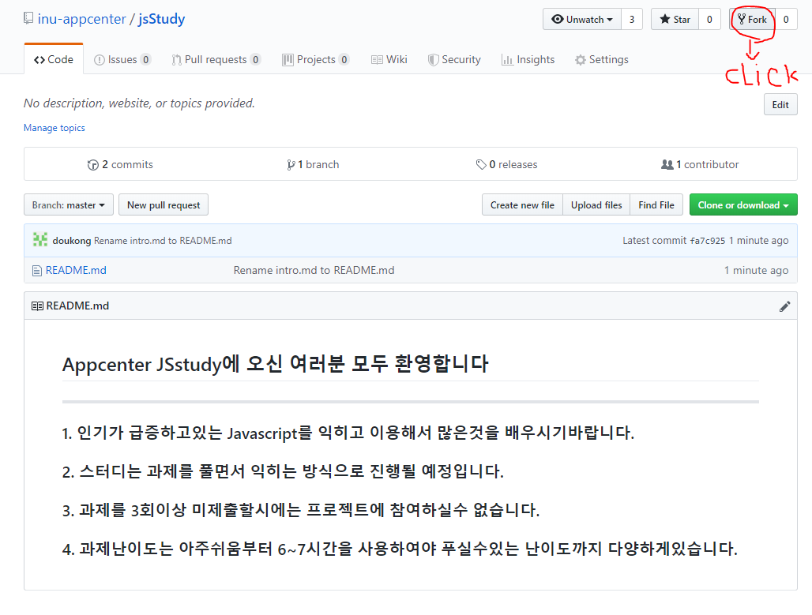
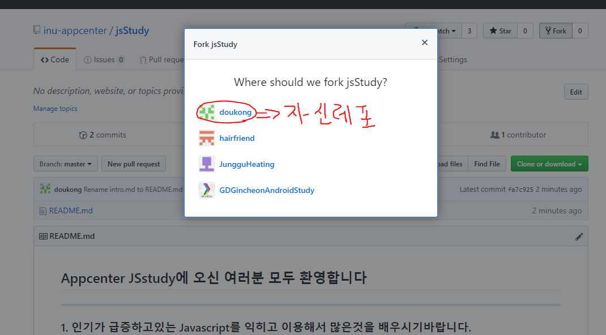
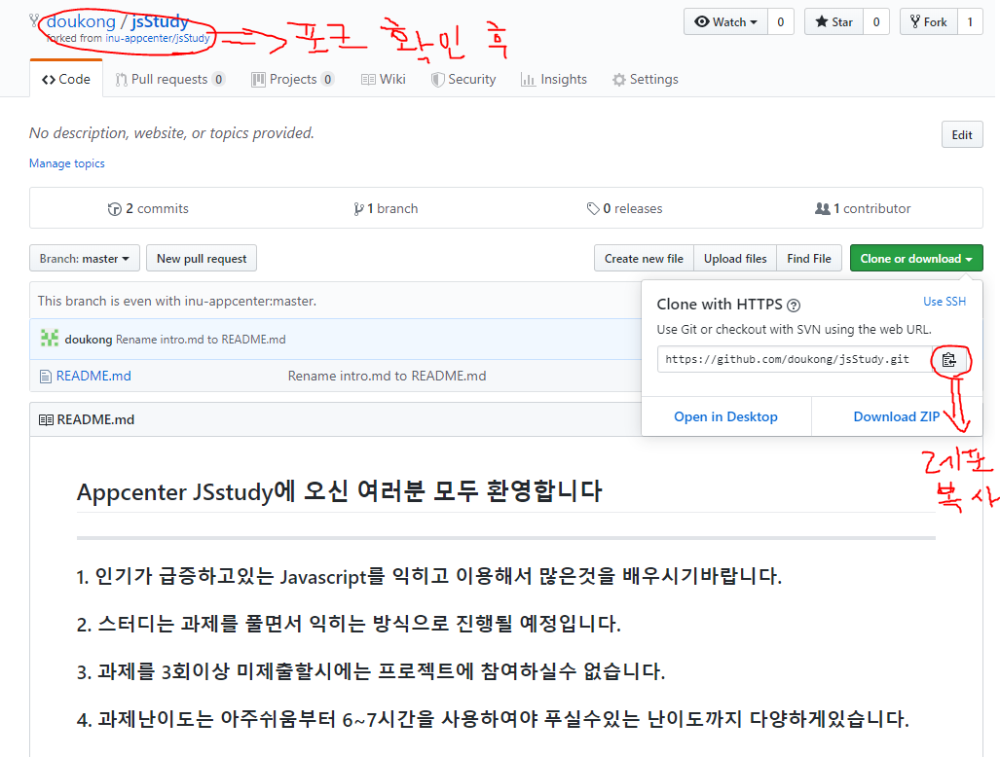
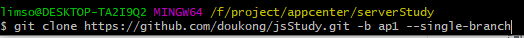
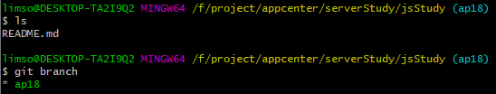
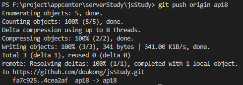
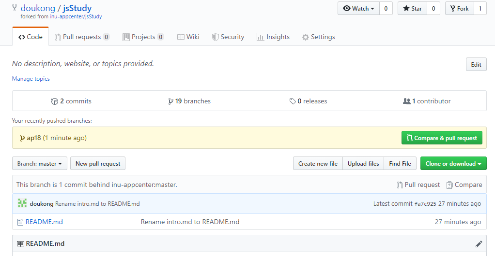
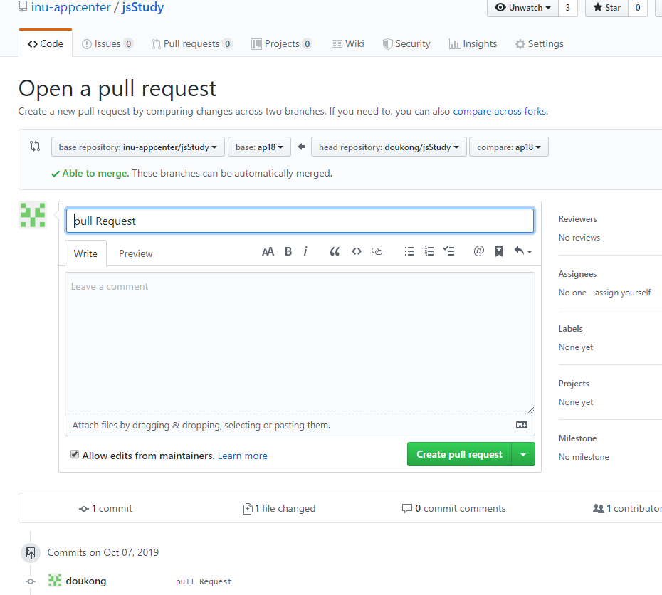

## Appcenter JSstudy에 오신 여러분 모두 환영합니다

---
#### 1. 인기가 급증하고있는 Javascript를 익히고 이용해서 많은것을 배우시기바랍니다.
#### 2. 스터디는 과제를 풀면서 익히는 방식으로 진행될 예정입니다.
#### 3. 과제를 3회이상 미제출할시에는 프로젝트에 참여하실수 없습니다.
#### 4. 과제난이도는 아주쉬움부터 6~7시간을 사용하여야 푸실수있는 난이도까지 다양하게있습니다.

- 진행방법
    - 순서대로 우선 깃을 클론한뒤 작업을 끝낸후 풀리퀘스트를 보내시면됩니다.
    - 1번

    - 2번

    - 3번

    - 4번
    - 자신만의 터미널 창을 여신뒤 자신의 번호에 맞는 브랜치로 클론하시면 됩니다.
    - 명령어 => git clone '레포이름' -b '자신번호' --single-branch

    - 5번
    - 클론을 하신뒤 맞는지 확인해주세요


- 1번과제에 더 자세하게 나와있으니 참고하시면 됩니다.

#### pull Request 날리는법(과제 제출하는 법)

- 진행방법
    - 1번
    - 작업을 완료한뒤 ```git add .```나 ```git commit -m "어쩌구저쩌구```같은 작업을 한뒤 자신의 포크한 깃레포 브랜치에 push합니다.
    - git push '자신이 fork한 레포' '자신의 브랜치번호'

    - 2번
    - 자신이 fork한 레포로 들어가 compare & pull request를 누릅니다.

    - 3번
    - 반드시 base에는 앱센터 레포가 있어야하며 base와 compare에는 자신의 브랜치 번호가 있어야합니다.
    - Leave a Comment에는 자신이 확인할 사항에대해 공부한것을 적어주시면 감사하겠습니다.

